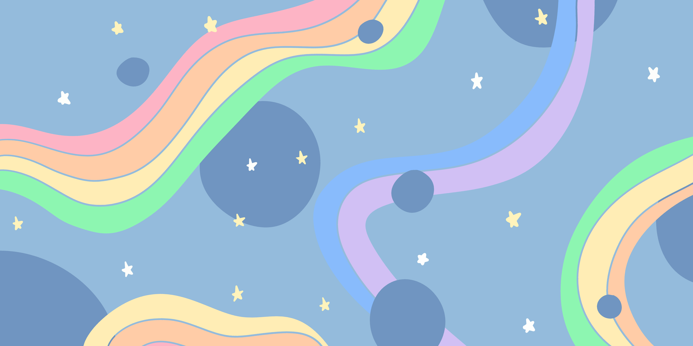

[](https://996.icu)
[](https://github.com/996icu/996.ICU/blob/master/LICENSE)
[](https://github.com/ellerbrock/typescript-badges/)

# Draw me a rainbow

A WEBGL interactive art work, with all my childhood fantasies 🌈

The work is still in development...



# How to run

1. Clone this repositories

2. Installation dependency

```
$ npm install
```

3. Build

```
$ npm run build
```